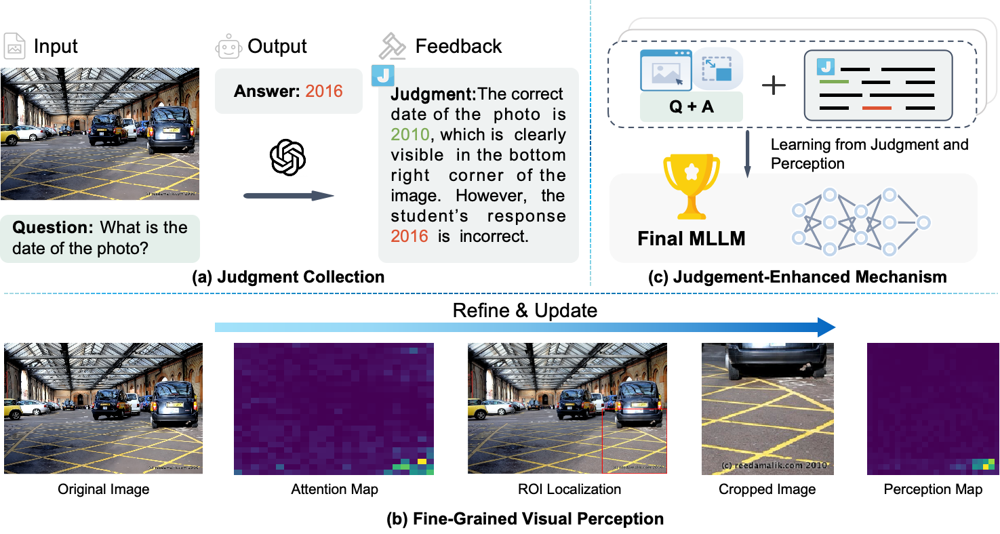
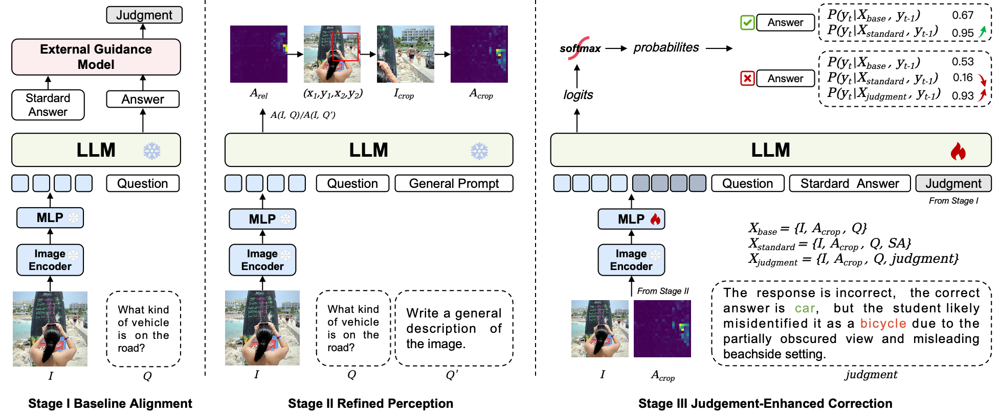

# JUDGER: Judgment-Enhanced Learning with Fine-Grained Visual Perception for Multimodal LLMs


## Overview
JUDGER is a novel multimodal learning framework designed to significantly enhance fine-grained visual perception and reduce hallucinations in multimodal large language models (MLLMs). It incorporates a relative attention-based cropping strategy to highlight essential visual details and an adaptive judgment-enhancement mechanism to dynamically correct model predictions based on external expert-generated signals.


### Highlights
- Fine-Grained Visual Perception: Utilizes a relative attention mechanism to precisely localize and magnify visual details essential for answering complex visual questions.
- Judgment-Enhanced Learning: Employs external expert feedback to correct hallucinated or incorrect answers dynamically during the model inference process.
- Significant Performance Boost: Surpasses state-of-the-art models across multiple benchmarks, with remarkable improvements in datasets requiring fine-grained visual reasoning.


### Architecture
The JUDGER framework consists of three main stages:
- Baseline Alignment: Establishes preliminary visual-textual alignment and generates initial answers.
- Refined Perception: Enhances visual localization of relevant details using relative attention-based cropping.
- Judgment-Enhanced Correction: Incorporates expert judgment signals to iteratively refine and correct predictions, effectively mitigating hallucinations.


## Install
1. Clone this repository.
```bash
git clone https://github.com/your-repo/JUDGER.git
cd JUDGER
```
2. Install packages
```bash
conda create -n llava python=3.10 -y
conda activate llava
pip install --upgrade pip  # enable PEP 660 support
pip install -e ".[train]"
pip install flash-attn --no-build-isolation
```

## How to Generate Judgment Data

This project includes a convenient script, `utils/generate_judgment.py`, which automatically generates judgment data. This data helps correct errors made by visual question-answering (VQA) models, which is essential for training the JUDGER model.

### 🚀 **Environment Setup**
Install the required dependencies:

```bash
pip install openai
```
### 🔑 API Key Configuration
Edit the generate_judgment.py file to include your OpenAI API credentials:
```python
api_key = "your_api_key"
api_base = "https://api.openai.com/v1"
```
### 📂 Data Preparation
Prepare your input data in JSONL format. Each line should contain:
- question_id: Unique identifier for the question.
- prompt: The image-related question.
- text: The answer provided by the model.
- answer: The correct (ground-truth) answer.
- image: Filename of the corresponding image.
Example:
```json
{"question_id": "001", "prompt": "What is the color of the hat in the image?", "text": "blue", "answer": "red", "image": "example.jpg"}
```
### ⚙️ Running the Script
```bash
python generate_judgment.py \
  --input_jsonl path/to/input.jsonl \
  --output_jsonl path/to/output.jsonl \
  --start_idx 0 \
  --end_idx 500
```
- --input_jsonl (required): Path to the input file.
- --output_jsonl (optional): Path to save generated judgments. Defaults to automatic naming if omitted.
- --start_idx and --end_idx (optional): Specify indexes for batch processing.

### 📑 Output Format
The script outputs a JSONL file with an additional judgment field:
- If the model’s answer is correct, judgment is null.
- If incorrect, judgment provides feedback generated by GPT-4o:
```json
{
    "question_id": "001",
    "prompt": "What is the color of the hat in the image?",
    "text": "blue",
    "answer": "red",
    "image": "example.jpg",
    "judgment": "The model's answer is incorrect because the hat in the image is actually red, not blue."
}
```
This judgment data is then used to enhance the JUDGER model’s ability to correct its predictions, improving multimodal VQA accuracy.

## Run the JUDGER Demo
This guide helps you run a quick demo using the test_demo.py script to verify the JUDGER model’s inference capabilities.
Make sure you have:
- A trained JUDGER model placed in your directory (e.g., /path/to/your/model)
- A test image file (e.g., /root/vipuser/images/demo1.png)
Execute the demo script in your terminal:
```bash
python test_demo.py
```

## Dataset
Due to size constraints, only a sample of the JUDGER dataset (playground/data/dataset_sample.json) is provided in this repository. The complete dataset used in the paper is too large for direct inclusion. Please refer to the sample file for dataset structure and format. For the complete dataset, please contact the authors directly. The complete dataset will be made available via an external link shortly.

## Continuous Updates
🚀The **JUDGER** codebase, datasets, and pretrained model weights will be continuously updated. Stay tuned for further improvements and releases!

## Acknowledgments
This implementation is based on the [LLaVA](https://github.com/haotian-liu/LLaVA). We gratefully acknowledge their contribution.